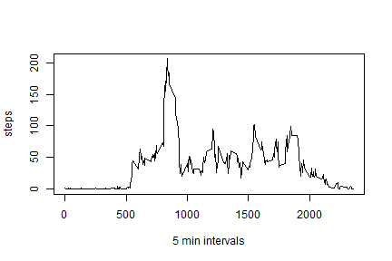

#
#


### 1. Loading and preprocessing the data
Read activity.csv

```r
activity <- read.csv("d:/github/pa1/activity.csv")
```

### 2. What is mean total number of steps taken per day?
Calculate total steps with NAs removed

```r
totSteps <- aggregate(steps ~ date, data = activity, sum, na.rm = TRUE)
```
Make a histogram of the total number of steps taken each day

```r
hist(totSteps$steps, main="Total steps by day", xlab="day", col="blue")
```

 

Calculate and report the mean and median total number of steps taken per day

```r
mean(totSteps$steps)
```

```
## [1] 10766
```


```r
median(totSteps$steps)
```

```
## [1] 10765
```

### 3. What is the average daily activity pattern?


```r
stepsInterval <- aggregate(steps ~ interval, data = activity, mean, na.rm = TRUE)
```
Make a time series plot (i.e. type = "l") of the 5-minute interval (x-axis) and the average number of steps taken, averaged across all days (y-axis)

```r
plot(steps ~ interval, data = stepsInterval, type = "l", xlab="5 min intervals")
```

 

Which 5-minute interval, on average across all the days in the dataset, contains the maximum number of steps?

```r
stepsInterval[which.max(stepsInterval$steps),]
```

```
##     interval steps
## 104      835   206
```


### 4. Imputing missing values
Calculate and report the total number of missing values in the dataset (i.e. the total number of rows with NAs).

```r
sum(is.na(activity$steps))
```

```
## [1] 2304
```

##### Devise a strategy for filling in all of the missing values in the dataset. The strategy does not need to be sophisticated. For example, you could use the mean/median for that day, or the mean for that 5-minute interval, etc.

###### Use average interval steps to fill in NAs

```r
interval2steps <- function(interval) {
    stepsInterval[stepsInterval$interval == interval, ]$steps
    }
```


```r
activityFilled <- activity 
```

Create a new dataset that is equal to the original dataset but with the missing data filled in.

```r
for (i in 1:nrow(activityFilled)) {
    if (is.na(activityFilled[i, ]$steps)) {
        activityFilled[i, ]$steps <- interval2steps(activityFilled[i, ]$interval)
    }
}
```


```r
totSteps2 <- aggregate(steps ~ date, data = activityFilled, sum)
```

Make a histogram of the total number of steps taken each day and Calculate and report the mean and median total number of steps taken per day.

```r
hist(totSteps2$steps, main="Total steps by day (NA values imputed)", xlab="day", col="green")
```

 

```r
mean(totSteps2$steps)
```

```
## [1] 10766
```

```r
median(totSteps2$steps)
```

```
## [1] 10766
```
##### Do these values differ from the estimates from the first part of the assignment?  What is the impact of imputing missing data on the estimates of the total daily number of steps?
###### No.  Little to no impact.


### 5. Are there differences in activity patterns between weekdays and weekends?
###### Yes, there are differences between weekend and weekday:  Higher number of steps overall on weekend.
Create a new factor variable in the dataset with two levels - "weekday" and "weekend" indicating whether a given date is a weekday or weekend day.

```r
activityFilled$day = ifelse(as.POSIXlt(as.Date(activityFilled$date))$wday%%6 == 0, "Weekend", "Weekday")
```


```r
activityFilled$day = factor(activityFilled$day, levels = c("Weekday", "Weekend"))
```


```r
stepsInterval2 = aggregate(steps ~ interval + day, activityFilled, mean)
```

Make a panel plot containing a time series plot (i.e. type = "l") of the 5-minute interval (x-axis) and the average number of steps taken, averaged across all weekday days or weekend days (y-axis)

```r
xyplot(steps ~ interval | factor(day), data = stepsInterval2, aspect = 1/2, type = "l")
```

 
